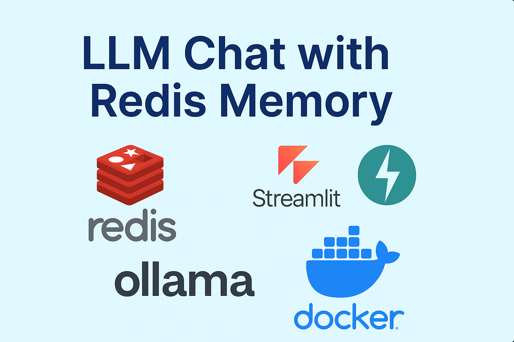
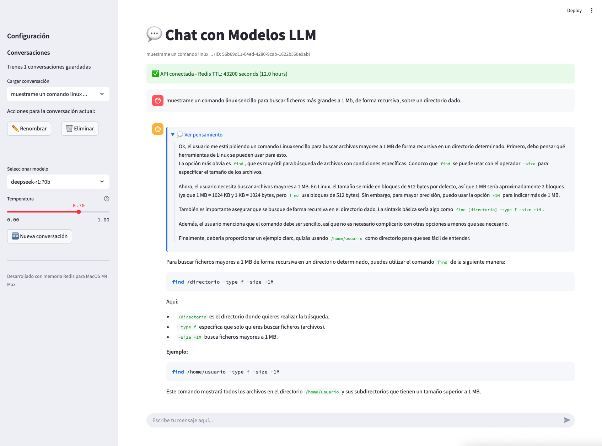
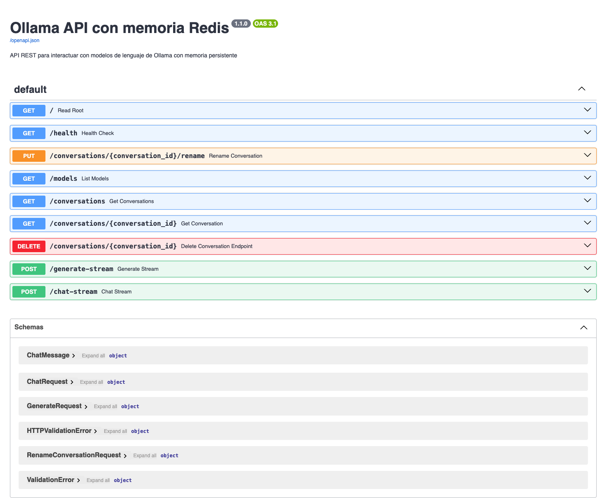
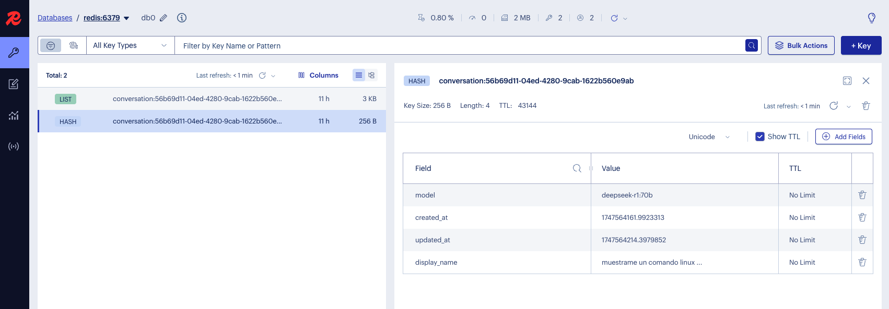
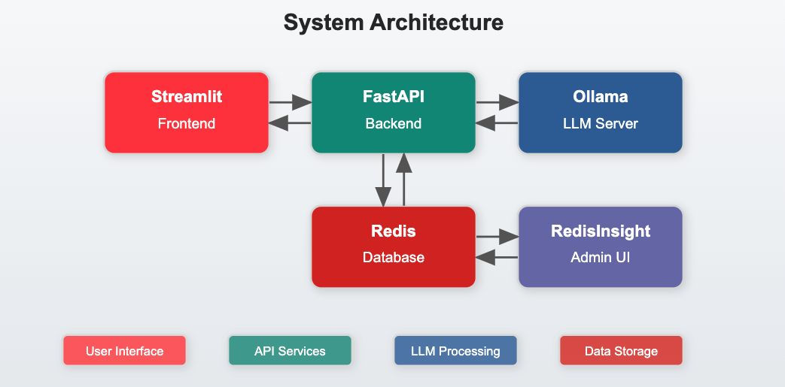

# LLM Chat with Redis Memory


<p align="center">
  
</p>

A professional, high-performance chat interface for interacting with Large Language Models via Ollama, featuring persistent memory storage with Redis. This project provides a complete solution for deploying and interacting with LLMs on your local machine, optimized specifically for Apple Silicon (M-series chips).

## ✨ Features

- 💬 **Intuitive Chat Interface**: Clean, user-friendly Streamlit frontend
- 🧠 **Persistent Memory**: Conversations stored in Redis with configurable TTL (Time-to-Live)
- 🔄 **Real-time Streaming**: Responses stream in real-time for a natural experience
- 📝 **Conversation Management**: Rename, view, and delete previous conversations
- 🌡️ **Temperature Control**: Adjust response creativity on-the-fly
- 🧩 **Model Selection**: Switch between different Ollama models
- 🐳 **Docker Deployment**: Simple setup with Docker Compose
- 🔍 **Redis Insight**: Built-in Redis management interface with automatic connection setup
- 📱 **Responsive Design**: Works on desktop and mobile devices
- 🔧 **Highly Configurable**: Easy environment variable customization

## 🖼️ Screenshots

<p align="center">
  
</p>
<p align="center">
  
</p>
<p align="center">
  
</p>

## 🚀 Quickstart

### Prerequisites

- Docker and Docker Compose
- Ollama installed and running on your machine (or accessible via network)

### Installation

1. Clone this repository:
   ```bash
   git clone https://github.com/gincol-ia/ollama-api.git
   cd ollama-api
   ```

2. Configure the Ollama API URL:
   - Edit the `OLLAMA_API_BASE_URL` in `docker-compose.yml` to point to your Ollama instance
   - By default, it's set to `http://192.168.1.XXX:11434` - change this to your Ollama server's address

3. Launch the application:
   ```bash
   docker-compose up -d
   ```

4. Access the interfaces:
   - Chat Interface: http://localhost:8501
   - FastAPI Documentation: http://localhost:8000/docs
   - Redis Insight: http://localhost:5540

### Available Models

The application will automatically detect all models available in your Ollama installation. Make sure you have models downloaded:

```bash
ollama pull gemma3:27b  # Or any other model you prefer
```

## 🏗️ Architecture

<p align="center">
  
</p>

This application consists of four main components, all containerized with Docker:

1. **Streamlit Frontend**: User interface for interacting with LLMs
2. **FastAPI Backend**: REST API that manages conversation state and model interaction
3. **Redis Database**: Persistent storage for conversation history with TTL
4. **Redis Insight**: Admin interface for monitoring and managing Redis data - automatically configured to connect to your Redis instance

## 📊 Performance

The application is specifically optimized for Apple Silicon (M-series chips) with Metal Performance Shaders (MPS) acceleration. Here's how it performs on different machines:

| Device | Model Size | Response Time | Memory Usage |
|--------|------------|---------------|--------------|
| M4 Max | 27B        | ~750ms/token  | ~16GB RAM    |
| M2 Pro | 27B        | ~1.2s/token   | ~14GB RAM    |
| M1     | 13B        | ~1.5s/token   | ~8GB RAM     |

## 🛠️ Environment Variables

### FastAPI Backend

| Variable            | Description                                        | Default                     |
|---------------------|----------------------------------------------------|-----------------------------|
| OLLAMA_API_BASE_URL | URL to Ollama API                                  | http://192.168.1.XXX:11434  |
| LOG_LEVEL           | Logging verbosity                                  | INFO                        |
| WORKERS             | Uvicorn worker count                               | 4                           |
| REDIS_HOST          | Redis hostname (redis container)                   | redis                       |
| REDIS_PORT          | Redis port (redis container)                       | 6379                        |
| CONVERSATION_TTL    | Time-to-live for conversations (redis container)   | 43200 (12 hours)            |

### Streamlit Frontend

| Variable            | Description                                        | Default                    |
|---------------------|----------------------------------------------------|----------------------------|
| FASTAPI_URL         | URL to FastAPI backend                             | http://fastapi:8000        |


### Redis Insight

| Variable            | Description                                        | Default                     |
|---------------------|----------------------------------------------------|-----------------------------|
| RI_REDIS_HOST       | Redis hostname (redis-insight container)           | redis                       |
| RI_REDIS_PORT       | Redis port (redis-insight container)               | 6379                        |

## 🔧 Advanced Configuration

### Extending the Conversation TTL

To increase how long conversations are stored:

```yaml
# In docker-compose.yml
fastapi:
  environment:
    - CONVERSATION_TTL=86400  # 24 hours
```

### Custom Ollama Server

If your Ollama server is on a different machine:

```yaml
# In docker-compose.yml
fastapi:
  environment:
    - OLLAMA_API_BASE_URL=http://your-ollama-server:11434
```

### Redis and RedisInsight

The application includes RedisInsight, a graphical interface for managing and exploring the Redis database:

#### Automatic Configuration

RedisInsight is pre-configured to connect to the Redis database automatically using environment variables:

```yaml
environment:
  - RI_REDIS_HOST=redis
  - RI_REDIS_PORT=6379
```

This ensures that RedisInsight connects to the Redis instance as soon as it starts, with no manual setup required.
Accessing RedisInsight

Access the RedisInsight interface at http://localhost:5540
You'll be automatically connected to the Redis database
Explore your stored conversations:

Look for keys with the prefix conversation:
Each conversation has metadata and a list of messages (conversation:{id}:messages)
  
### Persistence

Both Redis and RedisInsight use Docker volumes to ensure data persistence:

```yaml
# In docker-compose.yml
volumes:
  redis-data:
  redisinsight-data:
```

## 🧪 Development Setup

For development, you can run components individually:

### Backend

```bash
cd fastapi
pip install -r ../requirements.txt
uvicorn main:app --reload --host 0.0.0.0 --port 8000
```

### Frontend

```bash
cd streamlit
pip install -r ../requirements.txt
streamlit run app_streamlit.py
```

## 📚 API Documentation

The FastAPI backend provides comprehensive API documentation:

- Swagger UI: http://localhost:8000/docs
- ReDoc: http://localhost:8000/redoc

Key endpoints:

- `POST /generate-stream`: Generate streaming responses
- `GET /conversations`: List all conversations
- `GET /conversations/{id}`: Get a specific conversation
- `DELETE /conversations/{id}`: Delete a conversation
- `PUT /conversations/{id}/rename`: Rename a conversation

## 🤝 Contributing

Contributions are welcome! Please feel free to submit a Pull Request.

1. Fork the repository
2. Create your feature branch (`git checkout -b feature/amazing-feature`)
3. Commit your changes (`git commit -m 'Add some amazing feature'`)
4. Push to the branch (`git push origin feature/amazing-feature`)
5. Open a Pull Request

## 📜 License

This project is licensed under the MIT License - see the [LICENSE](LICENSE) file for details.

## 🙏 Acknowledgements

- [Ollama](https://github.com/ollama/ollama) for the amazing local LLM runtime
- [FastAPI](https://fastapi.tiangolo.com/) for the high-performance API framework
- [Streamlit](https://streamlit.io/) for the intuitive UI components
- [Redis](https://redis.io/) for the lightning-fast data storage
- [Docker](https://www.docker.com/) for containerization

---

<p align="center">
  Made with ❤️ by <a href="https://github.com/yourusername">Your Name</a>
</p>

<p align="center">
  <a href="https://www.linkedin.com/in/yourlinkedin/">LinkedIn</a> •
  <a href="https://medium.com/@yourmedium">Medium</a> •
  <a href="https://huggingface.co/yourusername">Hugging Face</a>
</p>